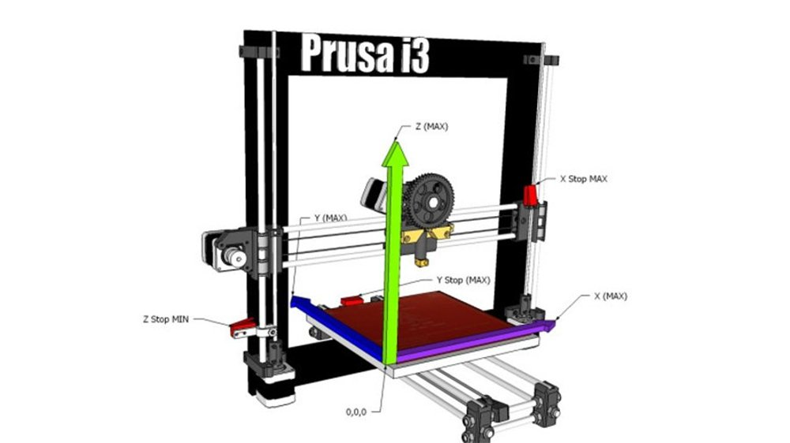

# GCode Cheat Sheet

This document is a cheat sheet I created for myself but perhaps it will be useful to others. I will continue to work on it as I learn more about gcode. If you see mistakes or have suggestions, please feel free to contact me at masood@masoodkamandy.com.

## Useful Resources

https://www.simplify3d.com/support/articles/3d-printing-gcode-tutorial/

https://all3dp.com/2/3d-printer-axis-the-basics-simply-explained/

## Coordinate System

One of the most basic things to understand in a 3D printer is the coordinate system it uses. This is often overlooked and abstracted away from the user by slicing software, but if you want to manipulate gcode, you'll need to understand how it works.

The coordinate system of the 3D printer uses millimeters and the maximum x and y values are specified by its bed size.



From the image you can see that the origin, or 0,0,0 is at the frontmost, leftmost point on the 3d printer's bed. From here it is safe to assume that you can print the full size of the bed which you can look up on the manufacturer's website.

The printer I'm working with is an Ender 3 Pro which has a bed size of 220x220 mm and a maximum z of 250 mm.

## Intro: A Breakdown of Common Line of Gcode

```xml
G1 F500 X1.00 Y0.00 E0.03326014
```

`G1` Move (`G0` and `G1` are both move commands. By convention G0 is a non-extrusion move.)

`F500` is the **movement speed**. Move at a speed of 500 mm/minute here. If you set the speed at one line, but don't the next line, the speed carries over until it is set again.

`X1.00 Y0.00` is the **destination in x and y coordinates**. Here we move in the x direction 1 mm and in the y direction 0.0 mm. These numbers can be floats or ints, but they are usually rounded to the mm.

`E0.03326014` is the **extrusion**. This extrudes ~0.03 mm of filament in this step. This is not always there because we don't always extrude when we move, but if there is an E argument, then we are extruding as we're moving.

## Centering Your Print

Although the origin of the print bed is in the front-most, left-most position on the bed, it doesn't make sense to print from that location if you have a small print.

It always makes sense to print in the center of the bed because it is the least subject to miscalibration.

An easy way algorithm to center a print in pseudocode is:

```pseudocode
    printOrigin.x = (bedWidth - printWidth) / 2;
    printOrigin.y = (bedHeight - printHeight) / 2;
```

You would need to move to this point using the following gcode:

```
G0 F6000 X<printOrigin.x> Y<printOrigin.y>
```

After using this algorithm the code to set all points relative to this origin is:

```
G92 X0 Y0 Z0
```

